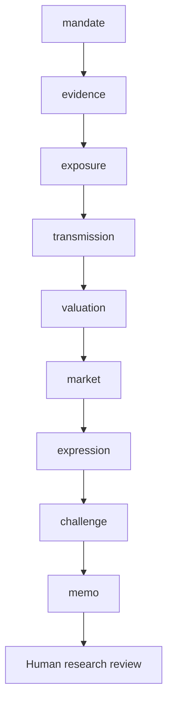

# Workflow

Which sustainability issues change revenue, margins, cash flows, credit or valuation, by how much and under which assumptions?

Routes: `equity`, `credit`, `issuer-review`. These named use cases share a sequential evidence/review core; they are not separately calibrated financial models.

| Step | Research task | Stage ID |
|---|---|---|
| 1 | Mandate and investable decision | `mandate` |
| 2 | Evidence intake and reconciliation | `evidence` |
| 3 | Economic exposure and materiality | `exposure` |
| 4 | Causal financial transmission | `transmission` |
| 5 | Financial bridge and sensitivity | `valuation` |
| 6 | Market context and implementation evidence | `market` |
| 7 | Investment-decision handoff | `expression` |
| 8 | Independent challenge and exceptions | `challenge` |
| 9 | Investment committee and accountable review | `memo` |

A COMPLETE artifact is structurally complete, not certified correct. Material gaps stop dependencies. Open MATERIAL/CRITICAL issues block research approval. A source-study intentionally stops after the evidence stage.
